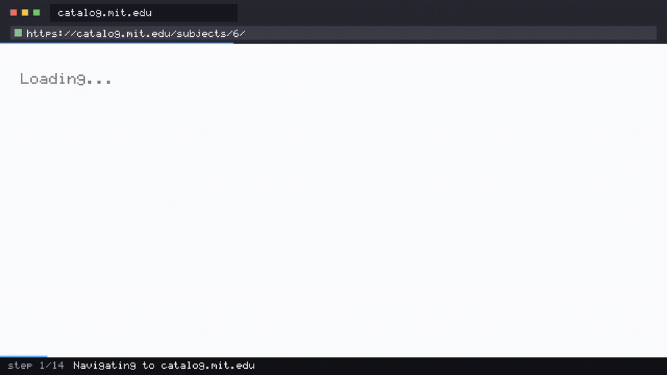

<div align="center">

# 🎓 Education Catalog Audit

**An AI agent that opens a real university course catalog, reads a department's subject listings, and reports units, prerequisites and terms offered — then films itself doing it.**

[](https://github.com/coasty-ai/coasty-education-catalog-audit/actions/workflows/ci.yml)
[](https://nodejs.org)
[](package.json)
[](#try-it-in-30-seconds)
[](LICENSE)



<sub><b>This is a real capture.</b> Every frame is a screenshot taken by a real browser driving real
software while a vision model read each screen and chose the next action - 5 steps, 5 model calls,
no script and no answer key. Provenance and per-frame hashes in <a href="media/capture.json">media/capture.json</a>.</sub>

</div>

---

- **Zero dependencies.** No `npm install`, no lockfile, no supply chain — pure Node built-ins.
- **Runs offline for $0.** No API key, no account. A bundled in-process mock runs the full agent loop on a fresh clone.
- **The demo video renders itself.** The frames come straight out of the run — against live Coasty they are the model's own input frames, so there is no storyboard that can drift.

## What this is

A complete, runnable [Coasty](https://coasty.ai) computer-use automation for **course catalog auditing**. It gives an AI agent one goal in plain English, and the agent drives a real browser to accomplish it — here, the SIS/CATALOG subject master inquiry — no selectors, no scraping rules, no DOM parsing to maintain.

Registrars, advising teams, transfer-credit evaluators and curriculum tools all need the same facts: what a department actually offers, how many units each subject carries, what it requires first, and which terms it runs in. Catalogs are the authoritative source for that, and almost none of them ship an API — they are HTML, they are re-authored every academic year, and each institution renders them differently. A scraper is a per-catalog selector set that breaks on the next redesign. An agent reads the page the way an advisor does, so the same prompt works across a re-skin and across institutions.

**Zero dependencies. Runs offline for $0 on a fresh clone. ~$0.70 to run for real.**

```
"Sign on to this Student Information System catalog terminal with operator
 ID REG04, then from the catalog function menu open SUBJECT MASTER INQUIRY.
 Run an inquiry for department code 30 - MATHEMATICS, with the Term Offered
 Filter set to SP - SPRING 2027 and the Course Level filter left on ALL
 LEVELS. Note how many records that selection returned. From the results
 list find the single subject carrying the HIGHEST number of credit units,
 then display the subject master detail for that subject number. Report:
 (1) how many records the inquiry selected, (2) that subject's number, (3)
 its title, (4) its credit units, and from the detail screen (5) its
 PREREQUISITES, (6) its INSTRUCTOR OF RECORD, (7) its ENROLLMENT CAP and
 (8) its CATALOG EFFECTIVE date. Quote every value exactly as the screens
 display it."
```

That prompt *is* the automation. When the site redesigns, the prompt still works.

## Try it in 30 seconds

No API key. No account. No install. No spend.

```bash
git clone https://github.com/coasty-ai/coasty-education-catalog-audit
cd coasty-education-catalog-audit
npm start
```

That boots a bundled offline mock in-process and runs the whole agent loop against it. Then render the demo video from the run's own frames:

```bash
npm run demo     # needs ffmpeg; writes media/demo.mp4 + demo.gif + poster.jpg
```

Check your setup any time with `npm run doctor`.

## Run it for real

**1. Get a Coasty API key** — create one at **<https://coasty.ai/developers/keys>**.
The raw key is shown *once*, at creation, so save it when it appears.
A `sk-coasty-test-…` **sandbox** key never bills and is enough to try this;
a `sk-coasty-live-…` key bills your wallet. A new key already carries the
`runs:read` and `runs:write` scopes this automation needs, so there is
nothing extra to enable.

**2. Give both consents, then run:**

```bash
export COASTY_API_KEY=sk-coasty-test-...      # from the link above
export COASTY_BASE_URL=https://coasty.ai/v1
export COASTY_ALLOW_LIVE=1                     # destination consent
npm start -- --live --confirm-cost-cents 120   # cost consent
```

Both consents are required and they are deliberately separate. A live key alone will not spend; a base URL alone will not spend. See [Safety](#safety).

| | |
|---|---|
| Expected cost | **70¢** (14 steps × 5 credits) |
| Worst case | **120¢** (24-step cap) |
| Model-input frames | **free** |
| Machine runtime | Coasty provisions and destroys its own VM |

`npm run estimate` prints this before anything runs.

## What the agent actually did

It was given the prompt above and nothing else - no selectors, no coordinates, no answer key -
then operated **SIS/CATALOG subject master inquiry** through a real browser:

```
software    SIS/CATALOG subject master inquiry
model       gpt-5.2
steps       5 (each = one screenshot, one decision, one action)
cost        ~$0.020
captured    2026-08-02
```

What it reported, read off the screen:

```
  (1) Records selected: "008"
  (2) Subject number: "MATH 3210"
  (3) Title: "REAL ANALYSIS I"
  (4) Credit units: "5.0"
```


## Safety

This repo is built so that **accidental spend is structurally impossible**, not merely discouraged:

- **Fail-closed destination.** An unset `COASTY_BASE_URL` resolves to the bundled offline mock. Production is never a default.
- **Two independent consents.** `COASTY_ALLOW_LIVE=1` authorises the *destination*; `--confirm-cost-cents N` authorises the *cost*, and N must equal the server-computed worst case exactly.
- **Idempotency by default.** The submit key is derived from the prompt, so a retried submit returns the original run instead of provisioning a second machine.
- **A hard cap per unit.** A worst case above `capCents` in [`automation.json`](automation.json) is refused before any request is made.
- **No credentials, ever.** This automation targets a public catalog. Nothing here reads a password, a token, or a cookie — and nothing here touches a student record.

## Project layout

```
automation.json      the entire unit definition — prompt, target, budget, caps
src/client.mjs       Coasty client: fail-closed target, retry, idempotency
src/capture.mjs      model-input frames → mp4/gif/poster, with sanity checks
src/cli.mjs          run · demo · estimate
tools/mock.mjs       the bundled offline Coasty (real 1280×720 PNG frames)
tools/doctor.mjs     preflight
test/                36 tests, zero dependencies, fully offline
```

Adding a new automation is one `automation.json` and one prompt — `src/` never forks. See [AGENTS.md](AGENTS.md) for the authoring contract used by Claude Code and Codex.

## Tests

```bash
npm test     # node --test, no install, no network, no key
```

## Related

Part of the **Coasty automation catalog** — computer-use automations across 12 industries. See [the index](https://github.com/coasty-ai) for finance, healthcare, legal, logistics, energy, public sector, HR, retail, manufacturing, nonprofit and e-commerce.

- [Coasty docs](https://coasty.ai/docs) · [API reference](https://coasty.ai/docs/llms.txt)
- [computer-use-cookbook](https://github.com/coasty-ai/computer-use-cookbook) — the API, by endpoint, in 4 languages
- [open-cowork](https://github.com/coasty-ai/open-cowork) — the open-source AI coworker

## License

MIT © Coasty
